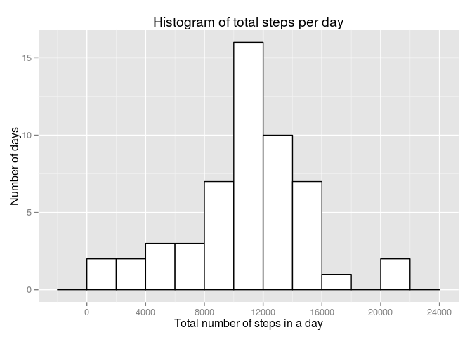
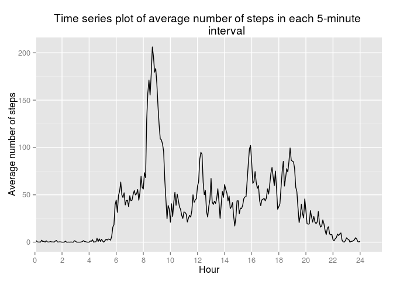
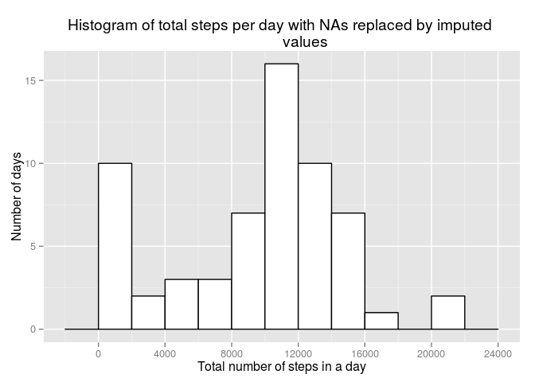
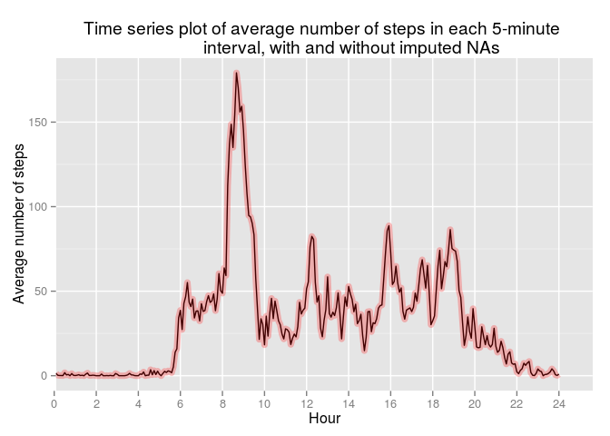
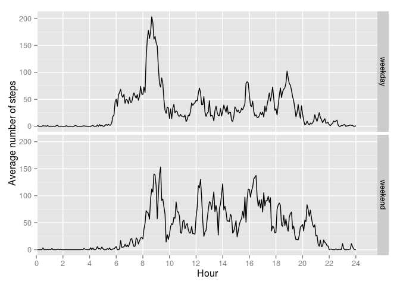

# Reproducible Research: Peer Assessment 1
This is a report on the first peer-reviewed assignment for thr Coursera Course
"Reproducible Research".

First we need to load the packages we'll use for processing the data and 
printing results (we use "message=FALSE" in the code chunk options to supress 
startup messages generated by the packages. We also set R global options to 
prevent scientific notation for numbers < 1e5.


```r
# (message=FALSE suppresses package startup messages.)
library(dplyr)
library(ggplot2)
options(scipen = 1, digits = 1)
```

###Loading and preprocessing the data

The assignment data is in a compressed csv file so we unzip it as the same time 
as reading it in and setting the "date" and "interval" columns to contain 
factors. It will be useful to have the interval variable as an ordered factor, so we make use of the fact that the first day's intervals (288 of them) are in order.

The `tbl_df` wrapper to the data frame is a convenience to prevent accidentally 
printing excessively large amount of data to the console.


```r
setwd("~/Dropbox/jhDataScience/RepData/RepData_PeerAssessment1")
# Read in data set.
step_count <- tbl_df(read.csv(unz("activity.zip", "activity.csv"),
                              colClasses=c('numeric', 'factor', 'factor')))
# Order the interval factor.
step_count$interval <- ordered(step_count$interval,step_count$interval[1:288])
# Create another data frame with NAs removed.
step_countc <- na.omit(step_count) # Create data set with NAs removed
```

###Mean total number of steps taken per day
We use the `dplyr` functions `group_by()` and `summarise()`to create a data frame giving the total steps for each day.


```r
per_day <- group_by(step_countc, date)
daily_steps <- summarise(per_day, daily_total=sum(steps, rm.na=TRUE))
# Calculate mean and median of the daily number of steps
mean_daily_steps <- mean(daily_steps$daily_total)
median_daily_steps <- median(daily_steps$daily_total)
```

Now we are ready to plot a histogram. 


```r
ggplot(daily_steps, aes(x=daily_total)) + 
    geom_histogram(binwidth=2000, colour="black", fill="white") +
    scale_x_continuous(breaks=seq(0,24000,4000)) +
    ggtitle('Histogram of total steps per day') +
    xlab('Total number of steps in a day') +
    ylab('Number of days')
```

 

The mean total number of steps in a day is 10767.2 and the
median total  is 10766. These are very close, so we would 
expect to see a reasonably symmetrical distribution. However, our subject had
two days when they walked more than usual in this period.

###Average daily activity pattern

Instead of grouping by day, we can group by five-minute inteval and look at the 
daily pattern if we average across the same interval for all 61 days.


```r
per_interval <- group_by(step_countc, interval)
interval_steps <- summarise(per_interval, interval_mean=mean(steps, rm.na=TRUE))
# Calculate the maxinum average number of steps in an interval
max_steps <- max(interval_steps$interval_mean)
# Extract the interval with the highest average.
max_steps_int <- filter(interval_steps, interval_mean==max_steps)$interval
```

The x-axis scale on the plot below shows the number of hours since the start of 
the day (i.e. the time on a 24 hour clock), rather than the interval identifier.


```r
# Convert the interval factors to fractions of an hour for the x-axis.
ggplot(interval_steps, aes(y=interval_mean, x=as.numeric(interval)/12)) + 
    geom_line() +
    scale_x_discrete(breaks=seq(0, 24, 2)) +
    ggtitle('Time series plot of average number of steps in each 5-minute 
            interval') +
    xlab('Hour') +
    ylab('Average number of steps')
```

 

The interval with the largest number of steps on average is 835
in which the subject took an average 206.2 steps.

The daily activity looks reasonable, with virtually no steps from midnight until
just before 6am.

###Imputing missing values
To deal with the issue of the missing measurements I replaced the NA values with
the immediately preceding value. With hindsight, I'm not sure this is the best 
way, and I'd like to do some more investigation because the method changes all 
NAs to zero. I suspect it would be a sensible method if the NAs were randomly 
scattered through the data rather than in long series.

Oh well, the results don't look too stupid!


```r
step_count$steps_imp <- rep(0, length(step_count$steps))
if(is.na(step_count$steps[1])){
    step_count$steps_imp[1] <- 0
    }
for (i in seq_along(step_count$steps)[-1]){
    if(is.na(step_count$steps[i])) {
        step_count$steps_imp[i] <- step_count$steps_imp[i - 1]
    }
    else{
        step_count$steps_imp[i] <- step_count$steps[i]
    }
}
```

Having replaced the NAs we recalculated the grouped data as before.


```r
per_dayi <- group_by(step_count, date)
daily_stepsi <- summarise(per_dayi, daily_totali=sum(steps_imp))
mean_daily_stepsi <- mean(daily_stepsi$daily_totali)
median_daily_stepsi <- median(daily_stepsi$daily_totali)
```

And plot another histogram:


```r
ggplot(daily_stepsi, aes(x=daily_totali)) + 
    geom_histogram(binwidth=2000, colour="black", fill="white") +
    scale_x_continuous(breaks=seq(0,24000,4000)) +
    ggtitle('Histogram of total steps per day with NAs replaced by imputed 
            values') +
    xlab('Total number of steps in a day') +
    ylab('Number of days')
```

 

The histogram looks very similar to the earlier one but, with number of days 
having a very low number of steps has increased - as you might expect since we 
have added in a load of zeros!

Next we repeat the grouping for the time series plot.


```r
per_intervali <- group_by(step_count, interval)
interval_stepsi <- summarise(per_intervali, intervali_mean=mean(steps_imp))
max_stepsi <- max(interval_stepsi$intervali_mean)
max_stepsi_int <- filter(interval_steps, interval_mean==max_steps)$interval
```

In this plot I've shown the original data (i.e. with NAs removed) as the black 
line, and the data with imputed NAs as the wider, slightly transparent red line.
 This shows that they are virtually identical.


```r
ggplot(interval_stepsi, aes(y=intervali_mean, x=as.numeric(interval)/12)) + 
    geom_line() +
    geom_line(aes(y=intervali_mean, x=as.numeric(interval)/12), colour="red",
              size=2.5, alpha = 0.25) +
    scale_x_discrete(breaks=seq(0, 24, 2)) +
    ggtitle('Time series plot of average number of steps in each 5-minute 
            interval, with and without imputed NAs') +
    xlab('Hour') +
    ylab('Average number of steps')
```

 

###Differences in activity patterns between weekdays and weekends

To look at the differences between weekdays and weekends we create a factor 
variable "wkday" with two values: "weekday" or "weekend". (In the process we created a variable of the day name - which seems convenient to have for checking.)


```r
step_count$day <- weekdays(as.Date(step_count$date), TRUE)
step_count$wkday <- factor(ifelse(step_count$day=="Sat" |step_count$day=="Sun" ,
                                  "weekend", "weekday"))
```

We have to do out grouping again:


```r
per_intervalw <- group_by(step_count, interval, wkday)
interval_stepsw <- summarise(per_intervalw, intervalw_mean=mean(steps_imp))
```

Now we can show the weekday and weekend activity separately.


```r
ggplot(interval_stepsw, aes(y=intervalw_mean, x=as.numeric(interval)/12)) + 
    facet_grid(wkday ~ .) +
    geom_line() +
    scale_x_discrete(breaks=seq(0, 24, 2)) +
    xlab('Hour') +
    ylab('Average number of steps')
```

 

There are some clear differences. For example, our subject gets up later on weekends.
